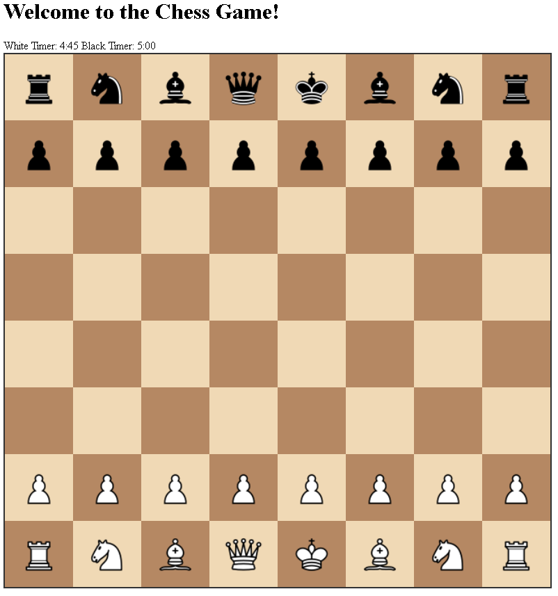
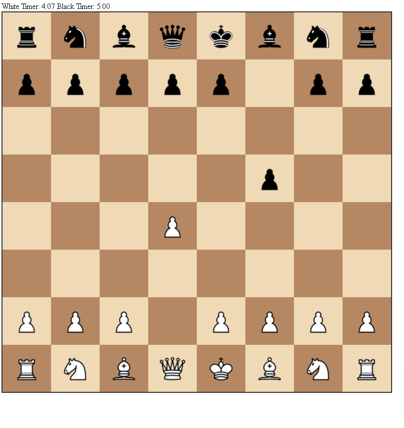
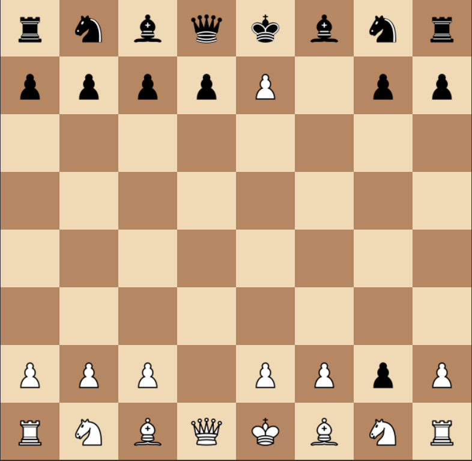

# Chess Game Application

This is a web-based chess game application that allows users to play chess, track game status, and train a neural network model using game data.

## Features

- Play chess against another player
- Track game status and timers
- Reset the game and timers
- Collect game data for training a neural network model
- Train a neural network model using collected game data

## Installation

1. Clone the repository:
    ```bash
    git clone https://github.com/yourusername/chess-game.git
    cd chess-game
    ```

2. Install the required dependencies:
    ```bash
    pip install -r requirements.txt
    ```

3. Run the application:
    ```bash
    python app.py
    ```

## Usage

- Open your web browser and navigate to `http://localhost:5000` to start playing chess.
- Use the provided API endpoints to interact with the game programmatically.

## Screenshots

### Game Board


### Move History


### Captured Pieces


## API Endpoints

- `POST /move`: Make a move in the game.
- `GET /status`: Get the current game status.
- `GET /captured_pieces`: Get the list of captured pieces.
- `POST /reset`: Reset the game.
- `POST /reset_timers`: Reset the game timers.
- `GET /game_data`: Collect game data.

## Contributing

1. Fork the repository.
2. Create a new branch (`git checkout -b feature-branch`).
3. Commit your changes (`git commit -am 'Add new feature'`).
4. Push to the branch (`git push origin feature-branch`).
5. Create a new Pull Request.

## License

This project is licensed under the MIT License.